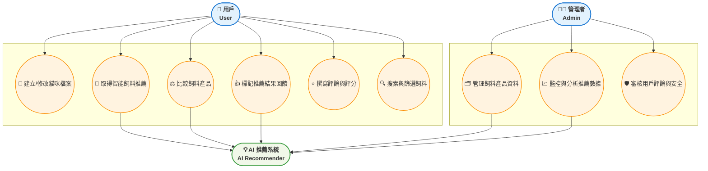

HW3:AI 智能貓咪飼料推薦系統專題計畫
# 一、功能性需求 (Functional Requirements)

1. 帳戶與偏好管理 (Account & Preferences)
- **F1.1** 註冊與登入：系統允許用戶註冊帳號並登入平台以進行個人化操作。
- **F1.2** 貓咪檔案建立：用戶可為多隻貓咪建立獨立檔案，記錄年齡、體重、品種、絕育狀態、活動量與健康狀況（如過敏、疾病）。
- **F1.3** 飼料偏好設定：用戶可記錄貓咪對特定飼料的喜好度、口感偏好（顆粒大小）與預算範圍。
  
2. 智能推薦與分析 (Recommendation & Analysis)
- **F2.1** 核心推薦：系統運用 AI 演算法，根據貓咪檔案數據，生成最適合的前五名飼料推薦清單。
- **F2.2** 推薦優化：用戶可對推薦結果標記「喜歡/不喜歡」，系統應根據回饋動態調整推薦權重。
- **F2.3** 營養成分分析：系統應顯示推薦飼料的詳細營養成分（蛋白質、脂肪、碳水、灰分等），並與理想值進行對比。
  
3. 資料庫與搜索 (Database & Search)
- **F3.1** 飼料搜索：系統提供搜索功能，允許用戶根據品牌、主要成分、特殊功效等關鍵字搜索飼料。
- **F3.2** 飼料比較：系統允許用戶選擇兩到三款飼料進行並排比較，突顯其營養成分、價格與用戶評分差異。
- **F3.3** 資料維護：系統管理者可新增、修改或刪除飼料產品資訊與營養標準數據。

# 二、非功能性需求 (Non-Functional Requirements)

1. 效能 (Performance)
- **N1.1** 核心推薦回應時間：用戶點擊「開始推薦」後，AI 推薦運算時間不得超過 2 秒。
- **N1.2** 並發用戶數：系統必須支援至少 500 位用戶同時在線查詢和執行推薦操作。
- **N1.3** 頁面載入速度：所有飼料清單頁面應在 2 秒內完成載入。
  
2. 安全性 (Security)
- **N2.1** 數據加密：所有貓咪健康數據（如體重、過敏史）必須在傳輸時使用 HTTPS，儲存時使用 AES-256 加密。
- **N2.2** 密碼儲存：所有使用者密碼必須以加密雜湊方式（例如 SHA-256）儲存。
  
3. 可用性 (Usability)
- **N3.1** 移動設備支援：系統必須支援行動裝置（RWD 自適應網頁設計），提供一致且友好的操作體驗。
- **N3.2** 直觀性：貓咪檔案建立流程必須簡潔直觀，用戶應在三個步驟內完成主要數據輸入。


# 三、功能分解圖(functional decomposition diagram, FDD)
```mermaid

flowchart TB
    %% 主系統（中心）
    A[🐈 AI 智能貓咪飼料推薦系統]:::main

    %% 上層模組
    A1[👤 帳戶與檔案管理<br>Account & Profile]
    A2[🧠 智能推薦核心<br>AI Recommendation Core]
    A3[🛒 飼料與購物管理<br>Product & Shopping]

    %% 下層模組
    A4[💬 社群與回饋<br>Community & Feedback]
    A5[⚙️ 系統與數據管理<br>System & Data Admin]

    %% 中心連線
    A1 --> A
    A2 --> A
    A3 --> A
    A --> A4
    A --> A5

    %% 第三層功能
    A1a[🔐 註冊與登入]
    A1b[📑 貓咪檔案建立與編輯]
    A1c[🩺 健康數據輸入與追蹤]
    A1d[💰 偏好與預算設定]
    A1a --> A1
    A1b --> A1
    A1c --> A1
    A1d --> A1

    A2a[🤖 推薦演算法 (AI Model)]
    A2b[📊 營養模型與理想值對比]
    A2c[👍 推薦結果回饋與優化]
    A2a --> A2
    A2b --> A2
    A2c --> A2

    A3a[🔍 飼料搜索與篩選]
    A3b[⚖️ 飼料並排比較]
    A3c[🔗 外部購買連結導向]
    A3a --> A3
    A3b --> A3
    A3c --> A3

    A4a[💬 飼料評論與評分]
    A4b[⭐ 收藏清單管理]
    A4c[📧 用戶建議與回報]
    A4a --> A4
    A4b --> A4
    A4c --> A4

    A5a[🗂️ 飼料產品資料庫維護]
    A5b[📈 推薦結果統計分析]
    A5c[🛡️ 安全與權限管理]
    A5a --> A5
    A5b --> A5
    A5c --> A5

    %% 樣式設定
    classDef main fill:#b3e5fc,stroke:#0288d1,stroke-width:2px,font-weight:bold;
    classDef layer1 fill:#c8e6c9,stroke:#388e3c,stroke-width:1.8px,font-weight:bold;
    classDef layer2 fill:#fff9c4,stroke:#fbc02d,stroke-width:1px;

    %% 套用樣式
    class A1,A2,A3,A4,A5 layer1;
    class A1a,A1b,A1c,A1d,A2a,A2b,A2c,A3a,A3b,A3c,A4a,A4b,A4c,A5a,A5b,A5c layer2;

```
# 四、使用案例

# 五、使用案例說明 (Use Case Descriptions)

## 使用案例 UC001：建立/修改貓咪檔案
| 欄位 | 內容 |
|------|------|
|使用案例編號|UC001|
|功能編號|F1.2|
|前置條件|用戶已登入系統|
|後置條件|貓咪檔案成功建立或更新，數據儲存於用戶個人資料庫|
|基本流程|1. 用戶點擊「新增貓咪」或選擇現有檔案 → 2. 輸入或修改數據（年齡、體重、健康狀況等） → 3. 系統驗證數據完整性 → 4. 儲存檔案並顯示操作成功提示|

---
## 使用案例 UC002：取得智能飼料推薦
| 欄位 | 內容 |
|------|------|
|使用案例編號|UC002|
|功能編號|F2.1|
|前置條件|用戶已登入，且已建立至少一個貓咪檔案|
|後置條件|系統顯示 AI 生成的前五名飼料推薦清單，並標示推薦理由|
|基本流程|1. 用戶選擇欲推薦的貓咪檔案 → 2. 系統讀取檔案數據與偏好 → 3. 系統執行 AI 推薦演算法 → 4. 推薦結果在 N1.1 約定時間內顯示，包含飼料名稱、評分與營養對比|

---

## 使用案例 UC003：比較飼料產品
| 欄位 | 內容 |
|------|------|
|使用案例編號|UC003|
|功能編號|F3.2|
|前置條件|用戶已登入，且至少選擇了兩款飼料產品|
|後置條件|系統顯示兩款飼料的並排比較結果頁面|
|基本流程|1. 用戶在清單或搜索結果頁面選中兩款飼料 → 2. 點擊「比較」按鈕 → 3. 系統提取並格式化兩款飼料的營養成分、價格與用戶評分 → 4. 顯示差異突出的並排比較表|
